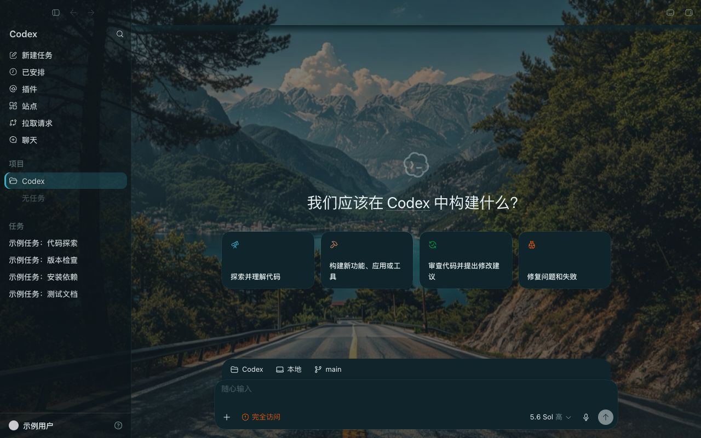
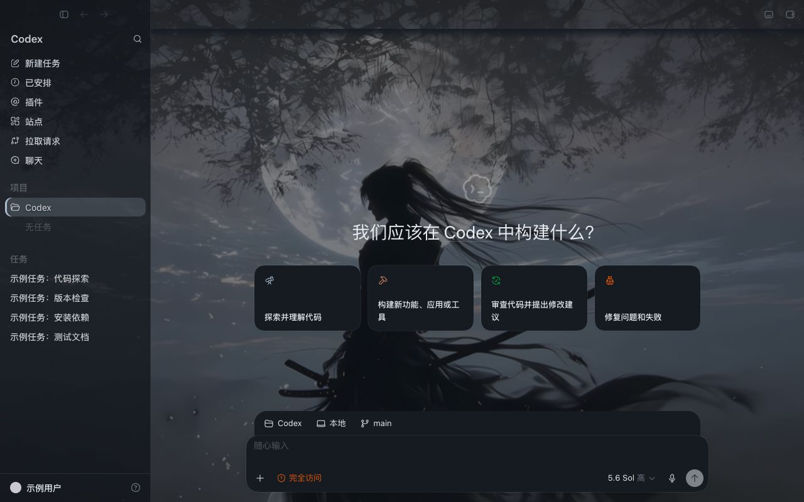
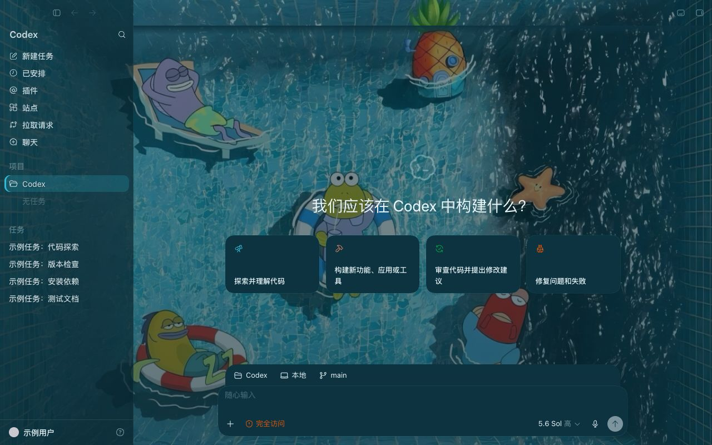

<div align="center">

# okkskin

### 给 Codex 桌面端换皮肤 —— 一条命令,整套界面配色 + 壁纸

[](LICENSE)
[](https://nodejs.org)
[](#支持平台)
[](https://github.com/fanbidog/okkskin/pulls)
[](https://github.com/fanbidog/okkskin/stargazers)

一条命令给 Codex 桌面端换一套皮肤 —— 整套界面配色 + 壁纸。
**不改任何 app 文件、不常开调试口、随时一键还原。**

中文

</div>

---

## 这是什么

Codex(ChatGPT 桌面端的 Codex)本身没有换肤入口。okkskin 让你从[皮肤库](https://www.okkmax.com)挑一款,复制一条命令在终端跑一下,Codex 的**整套界面配色 + 壁纸**就换好了 —— 而且**不动 Codex 安装包、不改代码签名**,随时能一键还原。

和其它做法不同,okkskin **不用带调试端口重启 Codex、也不常驻开着端口**:每次套用只对运行中的 Codex 主进程发一次「inspector 脉冲」,注完立即关口(见[原理](#原理))。

## 预览

|            山湖公路 · 自然             |            月下侠客 · 动漫             |
| :-----------------------------------: | :-----------------------------------: |
|   |  |

|           傲娇少女 · 浅色            |            夏日泳池 · 卡通            |
| :---------------------------------: | :----------------------------------: |
|  |  |

|                启动页(换肤后的开屏)                 |
| :--------------------------------------------------: |
|                    |

> 均为换肤后的真实 Codex 界面。主题挑选见[皮肤库](https://www.okkmax.com)。

## 用法

```bash
# 持久(推荐):以后每次打开 Codex 都自动套上,含 Dock 启动
npx okkskin@0.2.0 enable <manifest URL | 本地主题目录>
npx okkskin@0.2.0 disable       # 停用常驻 + 还原

# 单次:只对当前这次会话生效,退出即失
npx okkskin@0.2.0 apply <manifest URL | 本地主题目录>

# 其它
npx okkskin@0.2.0 status | restore | doctor
```

`<manifest URL>` 是从[皮肤库](https://www.okkmax.com/tools/skins)复制的链接:

```
https://www.okkmax.com/skins/<id>/manifest.json
```

任意目录都能跑,**不需要先 cd**。CLI 会:验 ed25519 签名 manifest → 按 SRI 校验主题 JSON 与背景图 → 净化图片(强制重新转码)→ 再注入。

## 原理

对**运行中的** Codex 主进程发一次 inspector 脉冲:

1. `process._debugProcess(pid)`(macOS 即 `SIGUSR1`)打开主进程 Node inspector(`127.0.0.1:9229`)
2. 经 `webContents.executeJavaScript` 向渲染进程注入主题 CSS,并挂一个 `dom-ready` 重注钩子(刷新自动补注)
3. `process._debugEnd` **立即关闭** inspector 端口

配色来自**覆盖 Codex 自身的设计 token**(`--color-*` / `--codex-base-*`),整套文字/图标/边框/按钮随之重上色;首页铺壁纸,对话页用主题实色底保证可读。**全程不碰 `app.asar`、不破坏代码签名。**

跨启动持久(`enable`)靠一个登录级常驻 agent:每次 Codex 启动时脉冲补套一次(不持有端口、不重启 Codex)。

## 安全

- inspector 只在**每次注入的那 ~1 秒**于 `127.0.0.1` 打开,注完即 `process._debugEnd` 关闭 —— **不在整会话期间敞着**。
- 主题数据经**签名 manifest + SRI 校验 + 图片净化**,注入的 JS/CSS **固定在 CLI 内**,不接受远端可执行内容。
- 残留风险:脉冲那一瞬开的是主进程 inspector,理论上同机进程能在窗口内抢连。**仅建议在个人可信设备使用**;不建议高敏账号 / 公司受管 / 多用户机器。
- `okkskin disable` / `restore` 可完全移除。不改 Codex 安装包与签名。

## 支持平台

- **macOS**:已支持并验证。
- **Windows**:代码已就绪(`process._debugProcess` + Appx 定位 + 任务计划程序常驻),但**尚未在真机验证**,暂标 beta。

## 做主题

一个主题 = 6 个颜色 + 1 张壁纸 + 明暗标记,人工按图手配。详见 [THEMING.md](THEMING.md)。

## 致谢

思路最初受 [Codex-Dream-Skin](https://github.com/Fei-Away/Codex-Dream-Skin)(MIT)启发;本实现为原创(inspector 脉冲 + 设计 token 覆盖),非其分支。

非 OpenAI 官方产品。Codex / ChatGPT 为 OpenAI 商标。

## 许可

[MIT](LICENSE)

</div>
